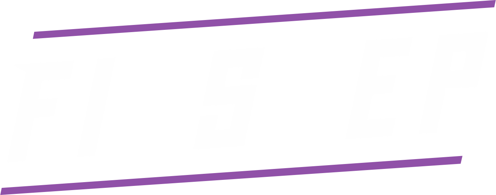

---

Finster - форк Einstein Engines, представляющего из себя хард-форк [Space Station 14](https://github.com/space-wizards/space-station-14), построенный на идеалах и дизайнерском вдохновении семейства серверов BayStation 12 от Space Station 13 с упором на модульный код, который каждый может использовать для создания RP-сервера своей мечты.

Основной упор сделан на перенос некоторого grimdark контента из SS13, под сильным вдохновеним Blackstone, RogueTown, LifeWeb и прочими форками. Большая часть ассетов взята оттуда.

## Ссылки

[Steam](https://store.steampowered.com/app/1255460/Space_Station_14/) | [Steam (SSMV Launcher)](https://store.steampowered.com/app/2585480/Space_Station_Multiverse/) | [Клиент без Steam (SSMV Launcher)](https://spacestationmultiverse.com/downloads/)  | [Flathub](https://flathub.org/apps/com.spacestation14.Launcher) |  [Основной репозиторий](https://github.com/Simple-Station/Einstein-Engines)

## Контрибуция

Вы можете следовать правилам офицальных репозиториев или EE.

Для работы с дизайн документами рекомендуется использовать [Obsidian](https://obsidian.md/) в качестве редактора `.md` файлов, а также для работы с некоторыми плагинами.

## Сборка

Следуйте [гайду от Space Wizards](https://docs.spacestation14.com/en/general-development/setup/setting-up-a-development-environment.html) по настройке рабочей среды, но учитывайте, что репозиторий отличается и некоторые вещи могут также отличаться.
EE предлагает несколько скриптов, показанных ниже, чтобы облегчить работу.

### Необходимые зависимости

> - Git
> - .NET SDK 8.0.100

### Windows

> 1. Склонируйте данный репозиторий
> 2. Запустите `git submodule update --init --recursive` в командной строке, чтобы скачать движок игры
> 3. Запускайте `Tools/bat/buildAllDebug.bat` после любых изменений в коде проекта
> 4. Запустите `Tools/bat/runQuickAll.bat`, чтобы запустить клиент и сервер
> 5. Подключитесь к локальному серверу и играйте

### Linux

> 1. Склонируйте данный репозиторий.
> 2. Запустите `git submodule update --init --recursive` в командной строке, чтобы скачать движок игры
> 3. Запускайте `Tools/sh/buildAllDebug.sh` после любых изменений в коде проекта
> 4. Запустите `Tools/sh/runQuickAll.sh`, чтобы запустить клиент и сервер
> 5. Подключитесь к локальному серверу и играйте

### MacOS

> Аналогично как и на Linux. В ином случае используйте `dotnet build` для сборки проекта.
