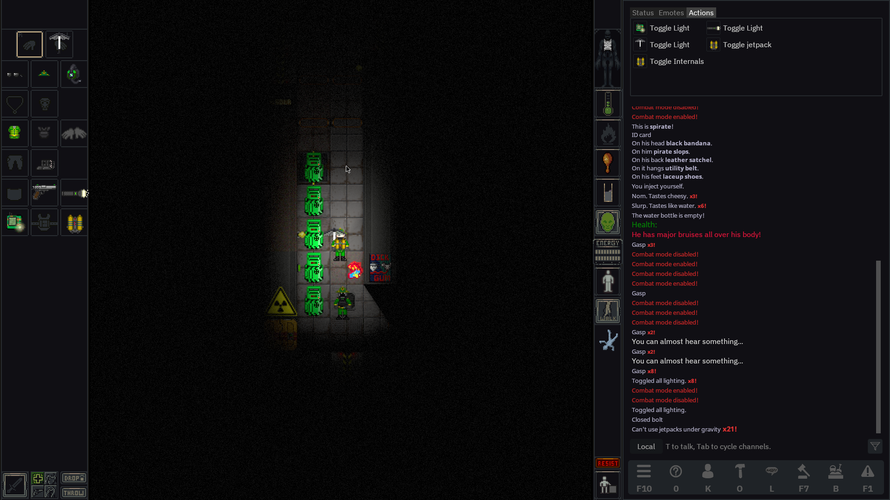

# NetPunk

[![en][icon-en]][en] [![ru][icon-ru]][ru]

[en]: ./README.md
[icon-en]: https://img.shields.io/badge/lang-en-red?style=flat-square
[ru]: ./README.ru.md
[icon-ru]: https://img.shields.io/badge/lang-ru-orange?style=flat-square

The main goal is to create a new game based on existing content for Space Station 14, with a focus on unique lore and RolePlay expirience.

## Links

[Steam](https://store.steampowered.com/app/1255460/Space_Station_14/) | [Steam (SSMV Launcher)](https://store.steampowered.com/app/2585480/Space_Station_Multiverse/) | [Non-Steam (SSMV Launcher)](https://spacestationmultiverse.com/downloads/)  | [Flathub](https://flathub.org/apps/com.spacestation14.Launcher) |  [Base(Upstream) repository](https://github.com/Simple-Station/Einstein-Engines) | [Discord server](https://discord.gg/Fmzp3kQ3AB)

## Contribution

To add large changes to the game it is recommended to create a Pull Request.
For small changes, make regular commit in **slave** branch.

## Building

Follow [Space Wizards guide](https://docs.spacestation14.com/en/general-development/setup/setting-up-a-development-environment.html) on setting up a working environment, but keep in mind that the repository is different and some things may also be different.
EE make some scripts shown below to make work easier.

### Dependencies

> - Git
> - .NET SDK 9.0.101

### Windows

> 1. Clone this repository
> 2. Run `git submodule update --init --recursive` at the command line to download the game engine
> 3. Run `Tools/bat/buildAllDebug.bat` after any changes to the project code
> 4. Run `Tools/bat/runQuickAll.bat` to start the client and server
> 5. Connect to the local server and play

### Linux

> 1. Clone this repository.
> 2. Run `git submodule update --init --recursive` at the command line to download the game engine
> 3. Run `Tools/sh/buildAllDebug.sh` after any changes to the project code
> 4. Run `Tools/sh/runQuickAll.sh` to start the client and server
> 5. Connect to the local server and play

### MacOS

> Same as on Linux. Otherwise try use `dotnet build` to build the project.

## License

👉 [LEGAL.md](./LEGAL.md)
